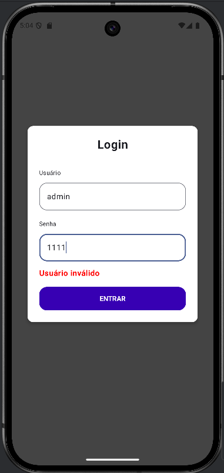
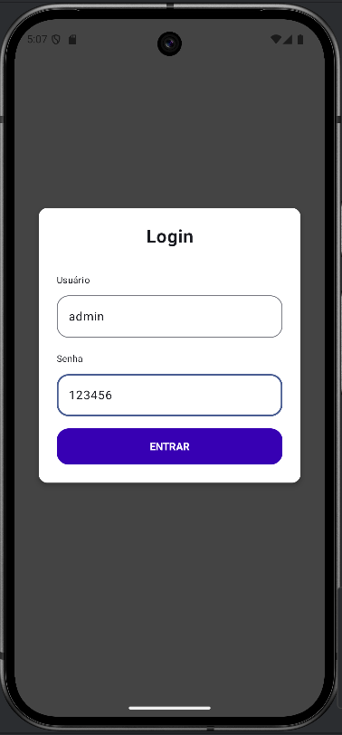
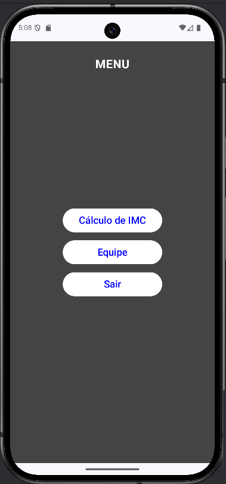
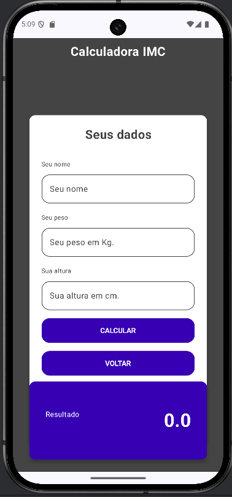
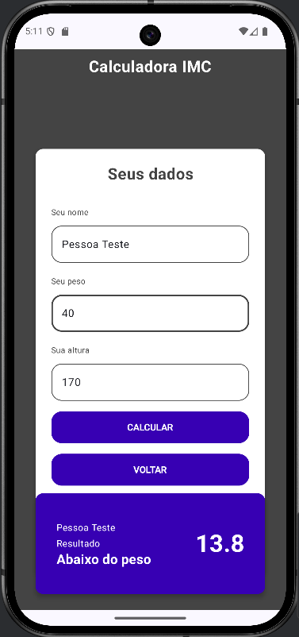
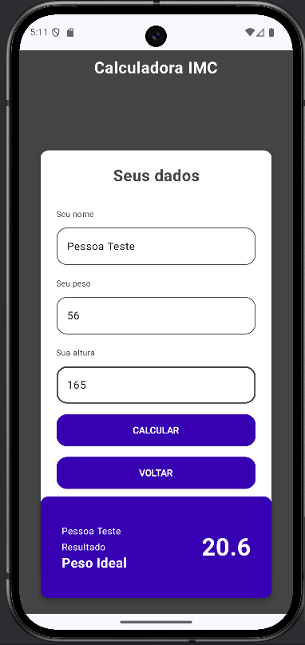
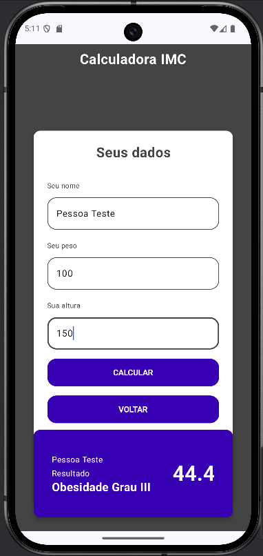
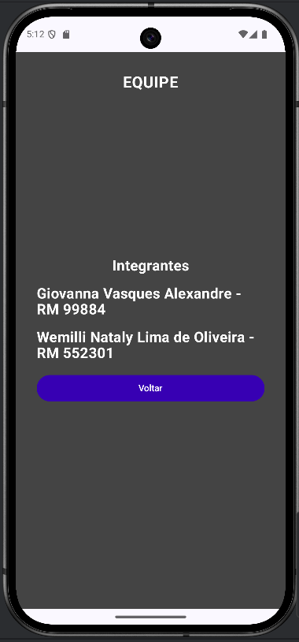

# Projeto IMC – Jetpack Compose
- Github de publicacao do projeto: givasques/gs2-2025-android

Projeto da GS2 - 2025 - 3SIR que envolve utilização do Jetpack Compose para construir uma aplicação simples com validação de login, menu de navegação, cálculo de IMC e identificação da equipe.

## Equipe
- Giovanna Vasques Alexandre - RM 99884
- Wemilli Nataly Lima de Oliveira - RM 552301

## Funcionalidades
### 1. Tela de Login
A tela de login contém dois campos:

- Usuário

- Senha

A validação é feita com:

- Usuário: admin

- Senha: 123456

### 2. Tela de Menu

A tela de menu contém dois botões:

- Cálculo de IMC

- Equipe

Além disso, há um botão para:

- Retornar ao Login

### 3. Tela de Cálculo de IMC

Requisitos atendidos:

- Campo adicional: Seu nome

- Cálculo automático do IMC após preencher peso e altura

- Botão para retornar ao Menu

Exibição:

- Valor do IMC

- Resultado do IMC

- Nome informado pelo usuário

### 4. Tela da Equipe

A tela da equipe contém:

- Nome dos integrantes da dupla

- Botão para retornar ao menu

## Telas do Projeto
### Tela de Login
- Comportamento ao informar dados incorretos

- Comportamento ao preencher com dados corretos (direcionamento para a tela Menu)

### Tela de Menu

- Ao clicar nos botões - direcionamento para as telas de IMC, Equipe e Login
### Tela de cálculo do IMC

- Preenchendo com valores acima, na média e abaixo do peso

### Tela da Equipe
